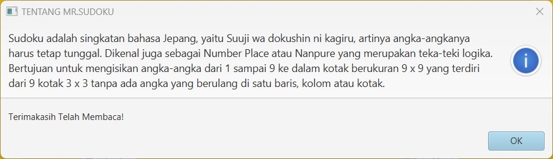

# SUDOKU

This repository is a final project (Java GUI) from Object-Oriented Programming Class, Teknik Informatika Universitas Padjadjaran. 

[Challenge Guidelines](challenge-guideline.md)

Projek ini merupakan projek bahasa pemrograman Java yang mengimplementasikan konsep Object-Oriented Programming dan Java GUI menggunakan JavaFX.
Sudoku merupakan puzzle yang berbasis logika dimana pemain dapat meletakkan angka pada kotak yang kosong. Sudoku terdiri dari 9 daerah 3x3 yang tersusun oleh 9 kotak 3x3 yang lebih kecil, dengan total 81 kotak. Tujuannya adalah pemain harus mengisi angka 1 sampai 9 pada kotak yang kosong dimana pada setiap baris, kolom, dan daerah 3x3 tidak ada angka yang berulang.

## Credits
| NPM           | Name                            |
| ------------- |---------------------------------|
| 140810210021  | Mohammad Zidan Yohanza          |
| 140810210063  | Sarah Khairunnisa Prihantoro    |
| 140810210065  | Zakia Noorardini                |

## Change log
- **[Sprint Planning](changelog/sprint-planning.md) - (planning date)** 
   - Tampilan grid 9x9 dengan subgrid
   - Tampilan menubar 
   - Tampilan level kesulitan  
   - Implementasi PBO pada Level
   - Mengacak angka pada grid  
   - Implementasi PBO pada About  
   - Implementasi PBO pada Help 
   - Implementasi PBO pada Restart 
   - Implementasi PBO pada Reset  
   - Implementasi PBO pada Exit 
   - Merombak ulang semua kode dari java.swing ke javafx 
   - Pembuatan Difficult                                                   
   - Mengacak Angka                            
   - Membuat Timer dan action pause dan resume 
   - Membuat menu Highscore dengan nama pemain 
   - Set angka yang tidak bisa diganti         
   - Cek input benar/salah                     
   - Perbaikan tampilan 

- **[Sprint 1](changelog/sprint-1.md) - (date from 15/11/2022 until 21/11/2022)** 
   - Tampilan grid 9x9 dengan subgrid
   - Tampilan menubar

- **[Sprint 2](changelog/sprint-2.md) - (date from 22/11/2022 until 28/11/2022)** 
   - Tampilan level kesulitan  
   - Implementasi PBO pada Level
   - Mengacak angka pada grid  
   - Implementasi PBO pada About  
   - Implementasi PBO pada Help 
   - Implementasi PBO pada Restart 
   - Implementasi PBO pada Reset  
   - Implementasi PBO pada Exit 
   
- **[Sprint 3](changelog/sprint-3.md) - (date from 29/11/2022 until 5/12/2022)** 
   - Merombak ulang semua kode dari java.swing ke javafx                    
   - Pembuatan Difficult                            
   - Mengacak Angka                           
   - Membuat Timer dan action pause dan resume 
   - Membuat menu Highscore dengan nama pemain 
   - Set angka yang tidak bisa diganti         
   - Cek input benar/salah                     
   - Perbaikan tampilan                       

## Running The App
- Arahkan directory pada repository.
- Arahkan ke folder SudokuhFX.
  ```shell
  cd SudokuhFX
  ```
- Jalankan dengan perintah gradlew run.
  ```shell
  ./gradlew run
  ```

## Classes Used
   - Class Sudoku (Main Program)(Program utama yang berisi method main.)
      - 2 Method
         - start() - Membuka file fxml dengan layout dan judul yang telah ditentukan
         - main() - Method main menjalankan progarm
       
   - Class SudokuController(Class yang mengorganisir fungsional dari tombol-tombol, serta menu-menu lainnya yang terdapat pada game)
      - 16 Method
         - Method Clear() untuk membersihkan area yang bisa diisi pemain
         - Method tentangClicked() untuk mengeksekusi tombol about apabila di klik
         - Method helpClicked() untuk mengeksekusi tombol help apabila di klik
         - Method exitClicked() untuk mengakhiri Program
         - Method initialize() untuk menginisiasi awal program
         - Method DrawOnCanvas() untuk menulis atau melukiskan sesuatu hal ke canvas 
         - Method canvasMouseClicked() untuk mengeksekusi click mouse pada canvas 
         - Method buttonOnePressed() merupakan tombol untuk memberikan angka 1 pada cell
         - Method buttonTwoPressed() merupakan tombol untuk memberikan angka 2 pada cell
         - Method buttonThreePressed() merupakan tombol untuk memberikan angka 3 pada cell
         - Method buttonFourPressed() merupakan tombol untuk memberikan angka 4 pada cell
         - Method buttonFivePressed() merupakan tombol untuk memberikan angka 5 pada cell
         - Method buttonSixPressed() merupakan tombol untuk memberikan angka 6 pada cell
         - Method buttonSevenPressed() merupakan tombol untuk memberikan angka 7 pada cell
         - Method buttonEightPressed() merupakan tombol untuk memberikan angka 8 pada cell
         - Method buttonNinePressed() merupakan tombol untuk memberikan angka 9 pada cell

   - Class SudokuBoard(Class yang menjadi logic dari permainan sudoku berfungsi menginisiasi papan yang diisi angka dan juga proses benar/salahnya game
      - 7 Method
         - Method getSolusi() untuk mengembalikan array solusi(jawaban dari program)
         - Method getInit() untuk mengembalikan array init(area yang read only tidak bisa ditulis pemain)
         - Method getPemain() untuk mengembalikan array pemain(area yang bisa ditulis pemain)
         - Method clearPemain() untuk membersihkan area yang bisa diisi pemain
         - Method modifPemain() untuk memodifikasi area pemain yang bisa ditulis
         - Method cekJawaban() untuk melakukan pengecekan terhadap jawaban pemain
         - Method cekJawabanUmum() untuk melakukan pengecekan terhadap jawaban pemain sesuai dengan aturan sudoku
       
   - Class sceneController(Class untuk mengganti halaman baru dan mengorganisir halaman baru tersebut)
      - 3 Method
         - Method gameClicked() untuk mengeksekusi game ketika tombol diklik
         - Method aboutyClicked() untuk mengeksekusi tentang sudoku ketika tombol diklik
         - Method keluarClicked() untuk keluar dari program ketika tombol diklik     
          
   - Class Time(Class untuk menjalankan timer)
      - 2 Method
         - Method getWaktuSekarang() untuk mengembalikan waktu dengan format (HH:MM:SS)
         - Method oneSecondPassed() untuk mengeksekusi looping waktu      

UML image here!


## Notable Assumption and Design App Details
1. Grid ubin dengan besar 9 x 9 yang terdiri dari 3 x 3 sub-grids dimana ubin adalah komponen drawing board dengan ukuran 540x540.
2. Navbar berisi File, Help, dan About
   - File berisi tombol untuk  Reset Game (menghapus input yang sudah ada), dan Exit (keluar dari Game)
   - Help berisi tombol Game Instructions untuk menampilkan cara bermain pada sudoku ini
   - About berisi tombol Sudoku Game untuk menampilkan penjelasan singkat tentang Sudoku Game
3. Angka yang tidak bisa diubah diberi warna hitam.
4. Angka yang diisi pemain berwarna hijau.
5. Masking terhadap ubin tertentu (angka disembunyikan dan dijadikan text field).
6. Ubin yang tidak dimasking bersifat read-only (angka didalamnya tidak bisa diubah).
7. Cell yang ditunjuk berwarna merah.
8. Terdapat sembilan tombol angka-angka, cara mengisi cellnya dengan mengklik cell lalu mengklik tombolnya sesuai angkanya.
9. Ada tampilan awal sebelum masuk ke game, terdapat 3 tombol New Game (untuk memulai game baru), About (untuk menampilkan penjelasan singkat tentang Sudoku Game), dan Exit (keluar dari Game).
10. Pada game ada timer untuk menghitung berapa lama pemain bermain game.
11. Terdapat tampilan "Sukses" jika semua cell = benar.

### Tampilan Awal


### Tampilan Game


### Tampilan Game Saat Input Angka


### Tampilan Saat Game Selesai


### Tampilan Menu About


### Tampilan Menu Help


### Tampilan Saat Exit Game

